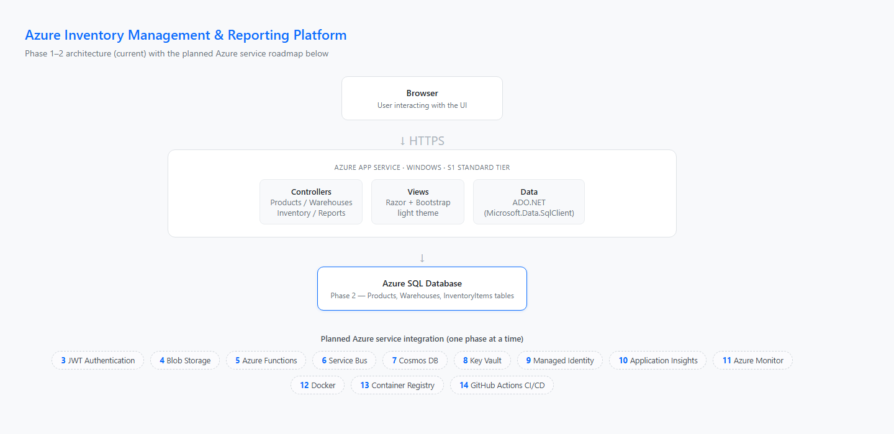
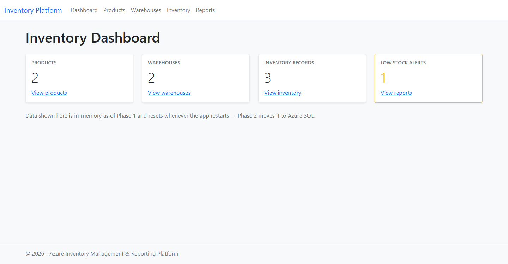
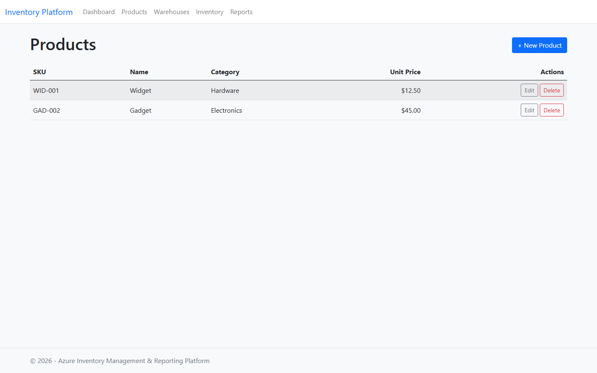
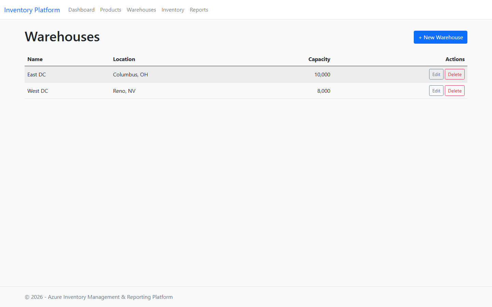
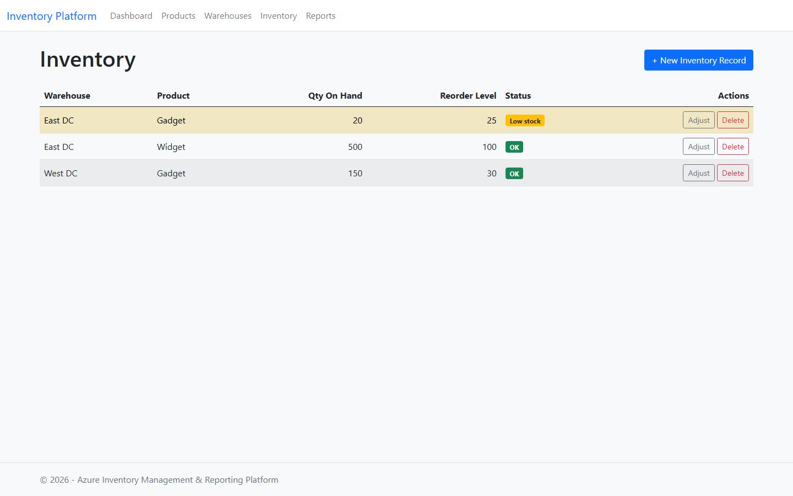
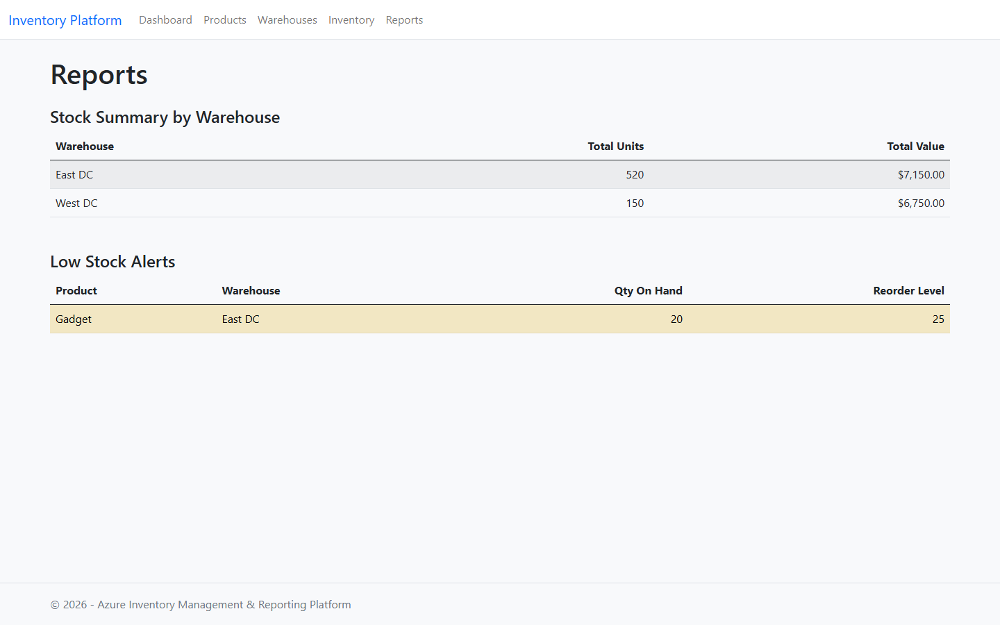

# Azure Inventory Management & Reporting Platform

> This repository is a learning portfolio.

An ASP.NET Core 8 MVC application for tracking products, warehouses, and stock
levels — built as a hands-on learning project covering the **AZ-204: Developing
Solutions for Microsoft Azure** topics. Rather than a collection of
disconnected demos, it's one real application that grows a new Azure integration
every phase, so each service is learned in the context of an actual feature it
supports.

## Project Overview

The app models a small inventory operation: products live in warehouses, stock
levels are tracked per product/warehouse pair, and reports surface stock summaries
and low-stock alerts. It starts simple (Phase 1: in-memory data, hosted on Azure
App Service) and incrementally adopts Azure SQL, JWT Authentication, Blob
Storage, Functions, Service Bus, Cosmos DB, Key Vault, Managed Identity,
Application Insights, Azure Monitor, Docker, Container Registry, and GitHub
Actions CI/CD — one phase, one Azure service, at a time. See
[Learning Journey](#learning-journey) for what's done so far.

## Features

- **Products** — CRUD with product code/name/unit price/reorder level
- **Warehouses** — CRUD with warehouse code/name/city
- **Inventory** — stock records linking a product to a warehouse, with a
  dedicated quantity-adjustment screen (`+`/`-` deltas rather than blind edits)
- **Reports** — stock value summary per warehouse, and a low-stock alert list
  (items at or below their product's reorder level), with the same rows
  visually flagged wherever they appear (Inventory list and Reports page)
- **Dashboard** — live counts across all four modules on the landing page
- **Excel import** — upload Products/Warehouses/Inventory spreadsheets and
  insert them straight into Azure SQL via ADO.NET

## Azure Services Used

| Service | Status | Purpose |
|---|---|---|
| Azure App Service | ✅ Phase 1 | Hosts the MVC app (Windows, S1 Standard tier) |
| Azure SQL | ✅ Phase 2 | Import excel from application to Azure SQL DB |
| JWT Authentication | ⬜ Phase 3 | Secures the app's endpoints with JWT bearer tokens |
| Blob Storage | ⬜ Phase 4 | Product images, exported report files |
| Azure Functions | ⬜ Phase 5 | HTTP, Blob-triggered, and Timer-triggered background work |
| Service Bus | ⬜ Phase 6 | Async inventory-changed events |
| Cosmos DB | ⬜ Phase 7 | Denormalized store for the Reports module |
| Key Vault | ⬜ Phase 8 | Secrets/connection strings out of config files |
| Managed Identity | ⬜ Phase 9 | Passwordless auth from App Service to the above |
| Application Insights | ⬜ Phase 10 | Telemetry, custom events/metrics |
| Azure Monitor | ⬜ Phase 11 | Alert rules and dashboards |
| Docker | ⬜ Phase 12 | Containerize the app |
| Azure Container Registry | ⬜ Phase 13 | Host the container image |
| GitHub Actions | ⬜ Phase 14 | CI/CD straight from this repo |

## Architecture Diagram



A single ASP.NET Core MVC app — no separate Web API layer and no repository
abstraction. Controllers call plain ADO.NET data-access classes directly, which
talk straight to Azure SQL:

```
src/AzureInventoryPlatform.Web/
  Models/        Product, Warehouse, InventoryItem, report DTOs
  Data/          ProductData, WarehouseData, InventoryData — ADO.NET/SqlClient
  Controllers/   Products, Warehouses, Inventory, Reports, Home
  Views/         Razor + Bootstrap, light theme
```

This intentionally stays as one project. An earlier version of this repo split
the API and UI into separate projects joined by a shared `Contracts` library —
pure ceremony for a learning project, and it caused a real bug (ASP.NET Core's
controller discovery scans every referenced assembly that touches
`Microsoft.AspNetCore.Mvc`, so the UI project ended up "discovering" and trying
to run the API's own controllers without the API's DI registrations wired up).
One project, calling Azure SDKs directly, sidesteps that entirely.

## Screenshots

| Dashboard | Products |
|---|---|
|  |  |

| Warehouses | Inventory |
|---|---|
|  |  |

| Reports |
|---|
|  |

## Learning Journey

Each phase below covers one Azure service, learned in the context of a real
feature of the app rather than an isolated demo:

| # | Phase | Status | Docs |
|---|-------|--------|------|
| 1 | App Service | ✅ Done | [docs/learning-notes/phase-01-app-service.md](docs/learning-notes/phase-01-app-service.md) |
| 2 | Azure SQL | ✅ Done | [docs/learning-notes/phase-02-azure-sql.md](docs/learning-notes/phase-02-azure-sql.md) |
| 3 | JWT Authentication | ⬜ Not started | |
| 4 | Blob Storage | ⬜ Not started | |
| 5 | Azure Functions (HTTP, Blob, Timer) | ⬜ Not started | |
| 6 | Service Bus | ⬜ Not started | |
| 7 | Cosmos DB | ⬜ Not started | |
| 8 | Key Vault | ⬜ Not started | |
| 9 | Managed Identity | ⬜ Not started | |
| 10 | Application Insights | ⬜ Not started | |
| 11 | Azure Monitor | ⬜ Not started | |
| 12 | Docker | ⬜ Not started | |
| 13 | Azure Container Registry | ⬜ Not started | |
| 14 | CI/CD (GitHub Actions) | ⬜ Not started | |

Each phase gets its own write-up in `docs/learning-notes/` covering: business scenario, the
Azure resource created, the code change, Azure Portal configuration steps,
deployment, and how it was tested.

## Future Enhancements

Tracked as the remaining AZ-204 phases (see the [Azure services table](#azure-services-used)
above), plus:
- Pagination and search on the Products/Inventory list pages
- Exporting reports to Blob Storage as CSV/PDF (natural fit once Phase 4 lands)
- A CI pipeline that runs `dotnet test` on every PR, ahead of the full CD story in Phase 14

## How to run locally

**Prerequisites:** [.NET 8 SDK](https://dotnet.microsoft.com/download/dotnet/8.0)
and a SQL Server instance — [SQL Server LocalDB](https://learn.microsoft.com/sql/database-engine/configure-windows/sql-server-express-localdb)
(bundled with Visual Studio) works well for local dev.

```bash
git clone https://github.com/niroshamozhin-star/AzureInventoryPlatform.git
cd AzureInventoryPlatform

# create the database and run the schema script once
sqlcmd -S "(localdb)\MSSQLLocalDB" -Q "CREATE DATABASE AzureInventoryPlatform"
sqlcmd -S "(localdb)\MSSQLLocalDB" -d AzureInventoryPlatform -i sql/schema.sql

# point the app at it (kept out of git via User Secrets)
cd src/AzureInventoryPlatform.Web
dotnet user-secrets init
dotnet user-secrets set "ConnectionStrings:InventoryDb" "Server=(localdb)\MSSQLLocalDB;Database=AzureInventoryPlatform;Trusted_Connection=True;TrustServerCertificate=True;"
cd ../..

dotnet run --project src/AzureInventoryPlatform.Web
```

Open `http://localhost:5104`. The app seeds itself with sample products,
warehouses, and inventory records on first run if the tables are empty.

Run the test suite with (uses the same connection string, via the same User Secrets):

```bash
dotnet test
```

## Security

No secrets, connection strings, or credentials are committed to this repository.
`.gitignore` excludes environment-specific config (`appsettings.Development.json`),
Visual Studio publish profiles (`*.pubxml`, `Properties/ServiceDependencies/`),
and common secret file patterns. The Azure SQL connection string is sourced from
[User Secrets](https://learn.microsoft.com/aspnet/core/security/app-secrets)
locally and an App Service Connection String setting in Azure — `appsettings.json`
only ever holds an empty placeholder. Later phases move this to
**Managed Identity** (Phase 9), removing the password entirely.

## Cost philosophy

This is a personal learning/portfolio project — most phases default to the
**free or cheapest tier** of each Azure service (Azure SQL serverless free offer,
Cosmos DB free tier, Functions Consumption plan, Service Bus Basic, etc.), covered
by an Azure free-trial subscription. Two exceptions: **App Service** (Phase 1) runs
on **S1 Standard/Windows** rather than the F1 Free tier, and **Azure Container
Registry** (Phase 13, Basic tier ≈ $0.17/day) has no free tier at all. Each
phase's doc calls out the tier used and its cost.

## License

[MIT](LICENSE)
